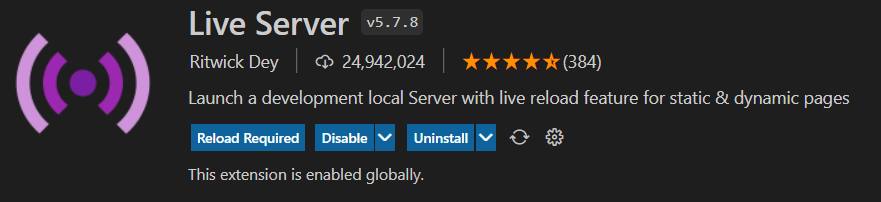
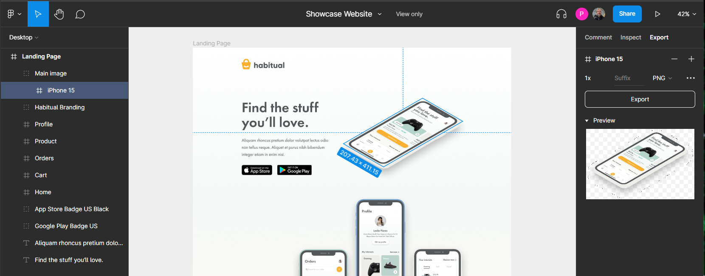

<!-- Improved compatibility of back to top link: See: https://github.com/othneildrew/Best-README-Template/pull/73 -->

<!--
*** Thanks for checking out the Best-README-Template. If you have a suggestion
*** that would make this better, please fork the repo and create a pull request
*** or simply open an issue with the tag "enhancement".
*** Don't forget to give the project a star!
*** Thanks again! Now go create something AMAZING! :D
-->

<!-- PROJECT SHIELDS -->
<!--
*** I'm using markdown "reference style" links for readability.
*** Reference links are enclosed in brackets [ ] instead of parentheses ( ).
*** See the bottom of this document for the declaration of the reference variables
*** for contributors-url, forks-url, etc. This is an optional, concise syntax you may use.
*** https://www.markdownguide.org/basic-syntax/#reference-style-links
-->
[![Contributors][contributors-shield]][contributors-url]
[![Forks][forks-shield]][forks-url]
[![Stargazers][stars-shield]][stars-url]
[![Issues][issues-shield]][issues-url]
[![MIT License][license-shield]][license-url]
[![LinkedIn][linkedin-shield]][linkedin-url]

<!-- PROJECT LOGO -->
 

  

<h3 align="center">Splash Page</h3>

  

    A modern looking landing page built from Figma Design ❄️
     
    <a href="https://github.com/Prasenjit-3433/Splash-Page-Design"><strong>Explore the docs »</strong></a>
     
     
    <a href="https://figmasplash.netlify.app/">View Demo</a>
    ·
    <a href="https://github.com/Prasenjit-3433/Splash-Page-Design/issues">Report Bug</a>
    ·
    <a href="https://github.com/Prasenjit-3433/Splash-Page-Design/issues">Request Feature</a>
  

<!-- TABLE OF CONTENTS -->

  
Table of Contents

  <ol>
    <li>
      <a href="#-about-the-project">About The Project</a>
      <ul>
        <li><a href="#-built-with">Tech Stack</a></li>
      </ul>
    </li>
    <li>
      <a href="#-getting-started">Getting Started</a>
      <ul>
        <li><a href="#prerequisites">Prerequisites</a></li>
        <li><a href="#installation">Installation</a></li>
      </ul>
    </li>
    <li><a href="#%EF%B8%8F-implementation">Implementation</a></li>
    <li><a href="#-features">Features</a></li>
    <li><a href="#-contributing">Contributing</a></li>
    <li><a href="#-license">License</a></li>
    <li><a href="#-contact">Contact</a></li>
    <li><a href="#%EF%B8%8F-references">References</a></li>
  </ol>

<!-- ABOUT THE PROJECT -->
## 🙋 About The Project

<!--   -->

  

Figma is a modern, streamlined design tool that makes the developer handoff process smooth and seamless. Developers now have better access to the designs and have the ability to extract information about typography, redlines, colors, measurement and more. 

In this project, a pre-designed Figma Design is brought into a real landing page!. 🔥

(<a href="#readme-top">back to top</a>)

### 🛠 Built With

* 
* 
* 

(<a href="#readme-top">back to top</a>)

<!-- GETTING STARTED -->
## 🚀 Getting Started

This is an example of how you may start on setting up your project locally.
To get a local copy up and running follow these simple example steps.

### Prerequisites

This is an example of how to list things you need to use the software and how to install them.
* Live Server Extension
  

### Installation

1. First of all install `Live Server` extension by `Ritwick Dey`.
2. Once the extension was installed, then `right-click` on `index.html` and select `Open with Live Server`.
3. It'll open a new tab in browser & start serving the Splash Page. Enjoy!.

(<a href="#readme-top">back to top</a>)

<!-- USAGE EXAMPLES -->
## 🏗️ Implementation

* In Figma, the Code panel offers an easy way to extract code information from a specific page element. The code will be displayed by clicking on a layer.
Currently, Figma supports CSS, Swift, and XML, but notice that most of the code available involves only visual properties and spacing. No Javascript or other logic is exported.

* The right hand panel provides code data for color values, typography, position and sizes. Additionally, designers have the option to add a text description to styles and components, which will be available in the same place. Finally, the panel supports two formatting styles for all three syntaxes: Table and Code. You can toggle them from a tab selector. The Code formatting style is very useful for quick copy and paste. Since the output code is structured in groups, you can extract only the ones you need. Groups split the code by position, text or colors.

 

* Then break the whole design into small `Ui Components` & start building indivisual components.

Ui Components:

<ol>
<li>
    

      
Title & Text

      <ul>
        <li>On click on the Title on the design of the Figma, the corresponding styles shows on left side.</li>
        <li>Copy and paste the styles from Figma & give the same style in style.css.</li>
        <li>Styles in Figma uses paid fonts. So here we use fonts from google fonts.</li>
        

      </ul>
    

  </li>
  </li>
  <li>
    

      
Image Assets

      <ul>
        <li>In order to import an image asset from Figma, first we need to click on the image & select the entire component at left side-bar.</li>
        <li>Then right side, navigate to `Export` tab.</li>
        <li>Select import format like PNG, JPG, SVg etc. and size like 1x, 2x etc.</li>
        <li>Finally click on `Export` button to download or preview it before download.</li>
        

      </ul>
    

    </li>
  <li>
    

      
Toggle Backgrounds

      <ul>
        <li>There're three divs at the right top to toggle between three backgrounds - One SVG , Two Linear-Gradients.</li>
        <li>On two consecutive click on same button leads to set background to default background of the Figma Design.</li>
      </ul>
    

  </li>
</ol>

_For more information, visit necessary references [Link](#%EF%B8%8F-references)_

(<a href="#readme-top">back to top</a>)

<!-- CONTRIBUTING -->
## 🤝 Contributing

Contributions are what make the open source community such an amazing place to learn, inspire, and create. Any contributions you make are **greatly appreciated**.

If you have a suggestion that would make this better, please fork the repo and create a pull request. You can also simply open an issue with the tag "enhancement".
Don't forget to give the project a star! Thanks again!

1. Fork the Project
2. Create your Feature Branch (`git checkout -b feature/AmazingFeature`)
3. Commit your Changes (`git commit -m 'Add some AmazingFeature'`)
4. Push to the Branch (`git push origin feature/AmazingFeature`)
5. Open a Pull Request

(<a href="#readme-top">back to top</a>)

<!-- LICENSE -->
## 📜 License

Distributed under the MIT License. See `LICENSE.txt` for more information.

(<a href="#readme-top">back to top</a>)

<!-- CONTACT -->
## 📮 Contact

Prasenjit Sutradhar - [@twitter_handle](https://twitter.com/twitter_handle) - prasenjitsutradhar3433@gmail.com

Project Link: [https://github.com/Prasenjit-3433/Splash-Page-Design](https://github.com/Prasenjit-3433/Splash-Page-Design)

(<a href="#readme-top">back to top</a>)

<!-- references -->
## ✌️ References

* [Figma For Developer](https://www.figma.com/best-practices/tips-on-developer-handoff/an-overview-of-figma-for-developers/)
* [Splash Page Design](https://www.figma.com/file/4KIM14zOqqIKRuF8kBtHGs/Showcase-Website?node-id=1%3A2)
* [HeroPatterns - Background](https://heropatterns.com/)
* [uiGradients - Background](https://uigradients.com/#Portrait)
* [Memory Leaks](https://auth0.com/blog/four-types-of-leaks-in-your-javascript-code-and-how-to-get-rid-of-them/)
* [Record heap snapshots](https://developer.chrome.com/docs/devtools/memory-problems/heap-snapshots/)

(<a href="#readme-top">back to top</a>)

<!-- MARKDOWN LINKS & IMAGES -->
<!-- https://www.markdownguide.org/basic-syntax/#reference-style-links -->
[contributors-shield]: https://img.shields.io/github/contributors/Prasenjit-3433/Splash-Page-Design.svg?style=for-the-badge
[contributors-url]: https://github.com/Prasenjit-3433/Splash-Page-Design/graphs/contributors
[forks-shield]: https://img.shields.io/github/forks/Prasenjit-3433/Splash-Page-Design.svg?style=for-the-badge
[forks-url]: https://github.com/Prasenjit-3433/Splash-Page-Design/network/members
[stars-shield]: https://img.shields.io/github/stars/Prasenjit-3433/Splash-Page-Design.svg?style=for-the-badge
[stars-url]: https://github.com/Prasenjit-3433/Splash-Page-Design/stargazers
[issues-shield]: https://img.shields.io/github/issues/Prasenjit-3433/Splash-Page-Design.svg?style=for-the-badge
[issues-url]: https://github.com/Prasenjit-3433/Splash-Page-Design/issues
[license-shield]: https://img.shields.io/github/license/Prasenjit-3433/Splash-Page-Design.svg?style=for-the-badge
[license-url]: https://github.com/Prasenjit-3433/Splash-Page-Design/blob/main/LICENSE.txt
[linkedin-shield]: https://img.shields.io/badge/-LinkedIn-black.svg?style=for-the-badge&logo=linkedin&colorB=555
[linkedin-url]: https://in.linkedin.com/
[product-screenshot]: images/screenshot.png
[HTML5]: https://img.shields.io/badge/HTML5-f06529?style=for-the-badge&logo=html5&logoColor=white
[HTML-url]: https://developer.mozilla.org/en-US/docs/Glossary/HTML5
[Css]: https://img.shields.io/badge/CSS3-2965f1?style=for-the-badge&logo=CSS3&logoColor=white
[Css-url]: https://developer.mozilla.org/en-US/docs/Web/CSS
[Js]: https://img.shields.io/badge/JavaScript-F0DB4F?style=for-the-badge&logo=JavaScript&logoColor=323330
[Js-url]: https://www.javascript.com/
